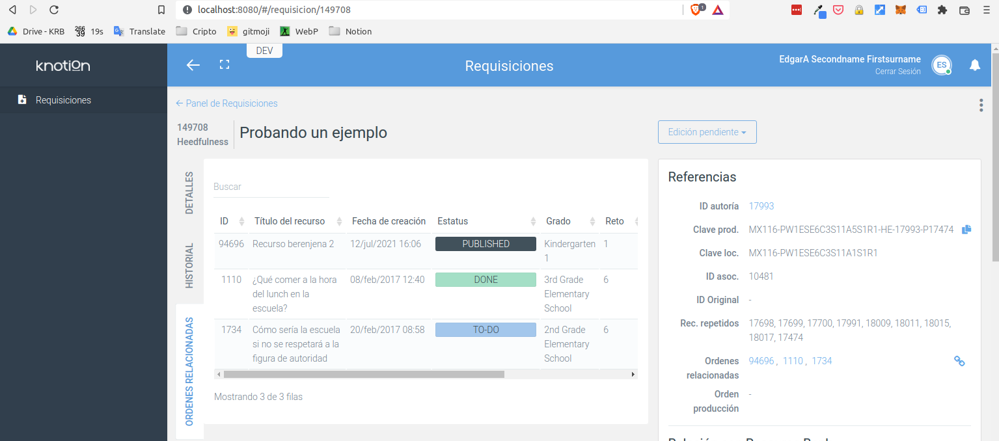

# Prueba técnica Frontend HabitatWeb

El objetivo de esta prueba es evaluar las habilidades del desarollador para adaptarse a un entorno de un proyecto legacy, utilizando las herramientas y funciones existentes para crear nuevas funciones, cuidando la legibilidad y escalabilidad del código nuevo.

Para fines de esta prueba hemos creado un repositorio con el código de una de las plataformas de [Knotion](https://knotion.com/) llamada Workflow, enfocada en el proceso productivo de recursos digitales educativos, pero en este caso conteniendo solamente el módulo de requisiciones, que es en el que se enfoca la prueba.

Esta aplicación se conecta con la API de Workflow en el entorno de desarrollo y cuenta con diversas herramientas que facilitan el desarrollo de nuevas características.

### Pestaña de órdenes relacionadas

Se deberá agregar una nueva pestaña en la vista de requisición individual, esta pestaña deberá mostrar una tabla con las órdenes de producción relacionadas con dicha requisición.

Para esto se deberá utilizar la función `tableInit` del script `app/scripts/table-init.js` que acepta diversos parámetros, entre ellos las columnas a mostrar, la url a consultar y los query params. Como referencia se puede consultar cómo está construida la vista del listado de requisiciones (panel). También es importante mencionar que ya existe en el repositorio un script que muestra un modal con la tabla de las órdenes relacionadas y que es utilizado en otras partes de la aplicación, por ejemplo es el que muestra el modal que se abre al dar click en la cadenita azul en el panel derecho del visor de requisición. Se valora mucho si se reutiliza el código que lista la tabla para evitar crear código duplicado. La url del endpoint para obtener las ordenes relacionadas es `{{url}}/related-orders` y se deben pasar por query params los siquientes valores:

```json
{
  "requisition_id": "{{requisition_id}}",
  "show_suggested": 0,
  "per_page": 10,
  "order_name": "id"
}
```

Las columnas a mostrar son las siguientes:
* ID
* Título del recurso
* Fecha de creación
* Status
* Grado
* Reto
* Tipo del recurso
* Traducción?
* Enlace a la orden

Para agregar la nueva pestaña hay que insertar un nuevo item (con los mismos atributos que los ya existentes) en el elemento `#detail-nav-tabs` (la aplicación cuenta con un plugin de tabs que realizará la lógica correspondiente para ir cambiando de pestaña). También hay que crear un elemento con el id referenciado en el item de la pestaña que mostrará la tabla y agregar la clase `.with-related-orders` al elemento `#detail-nav-tabs` para que se muestren correctamente las pestañas.

_Screenshot de referencia_


### ¿Cómo correr esta app?

* Install (if you don't have them):
    * [Node.js 10.x or newer](http://nodejs.org): `brew install node` on OS X
    * [Brunch](http://brunch.io): `npm install -g brunch`
    * Brunch plugins and app dependencies: `npm install`
* Run:
    * `brunch watch --server` — watches the project with continuous rebuild. This will also launch HTTP server with [pushState](https://developer.mozilla.org/en-US/docs/Web/Guide/API/DOM/Manipulating_the_browser_history).
    * El código base de esta prueba lanza un error de página no encontrada al abrir la app, solo hay que ignorarlo y dar click en el módulo de requisiciones.
    * `public/` dir is fully auto-generated and served by HTTP server.  Write your code in `app/` dir.
    * Para realizar pruebas utilizar el usuario 'rodrigo_a' y la contraseña '1234'

---

#### Más información (referencia sobre las librerías utilizadas por esta app)

* [Brunch site](http://brunch.io), [Getting started guide](https://github.com/brunch/brunch-guide#readme)
* [jQuery](http://api.jquery.com/) - v2.2.4
* [Bootstrap](http://getbootstrap.com/) - v3.3.6
* [Bublé](https://buble.surge.sh/guide/) - ES6 support
* [Pug](http://pugjs.org) - templates
* [Remark](http://getbootstrapadmin.com/remark/) - MOD - [Guía de iconos](http://getbootstrapadmin.com/remark/base/uikit/icons.html)
* [bootstrap-table](http://bootstrap-table.wenzhixin.net.cn/) - v1.10.1 MOD
* [Dropzone](http://www.dropzonejs.com/)
* [Sortable](https://github.com/RubaXa/Sortable)
* [easyRouter](https://github.com/aMarCruz/easyrouter)
* [jscc](https://github.com/aMarCruz/jscc) - usado con [jscc-brunch](https://github.com/aMarCruz/jscc-brunch)
* [Less](http://lesscss.org/)
* [js-cookie](https://github.com/js-cookie/js-cookie)
* [store2](https://github.com/nbubna/store) - localStorage y sessionStorage